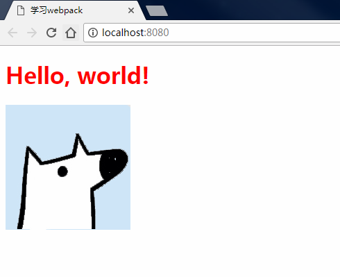

## 自己配置webpack3.0模板 

1. 使用`resolve.alias`设置模块别名，规范化模块的导入路径。使用`devServer.proxy`配置代理，解决开发过程中的跨域问题
2. 使用公共类库抽离和代码分割来优化代码，使打包后的代码体积更小，优化首屏加载体验
3. 搭配缓存功能使线上项目无须重新加载未更改的文件，极大的提高了用户体验
4. 搭配`html-webpack-plugin`、`clean-webpack-plugin`等插件，使打包过程中更加智能，一键化打包，而无须手动清除之前打包目录、引入打包后`js`等繁琐步骤

## 命令

```bash
npm install # 下载依赖
npm run dev # 开发模式
npm run build # 打包
```

如果运行`npm run dev`后出现以下图片显示的情况，则说明`webpack`是没问题的，`css`，`img`等都可以打包

